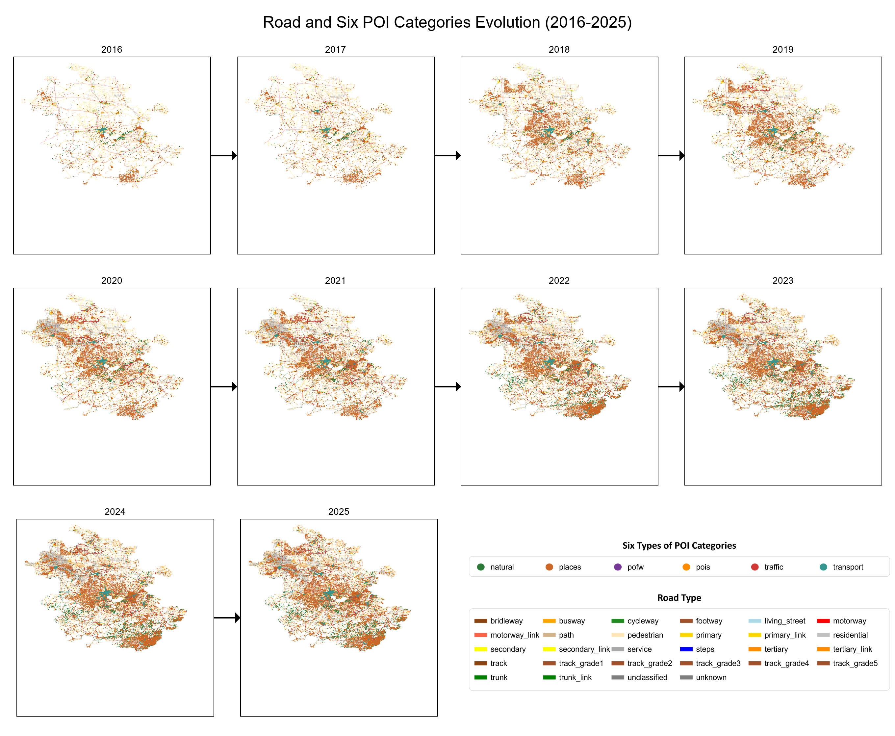

# 中国33个省级行政区2016–2025年道路与六类POI演变图集

本仓库展示了中国大陆**33个省级行政区（不含有台湾省）** 在2016年至2025年期间，**道路网络**（按28种fclass分类着色）与**六类POI（兴趣点）** 的时空演变综合图。每个省份一张高清PNG图片（1200 DPI），包含：

- 2016–2025年逐年道路+POI综合地图（网格排列，箭头连接时间流向）
- 年份标签（位于每张小图正上方）
- 统一图例（道路等级与POI类型）

所有图片均为A4纵向布局，PNG格式，适合直接用于论文、报告或可视化展示。

## 🗺️ 图例说明

图中右下角/右侧统一图例包含以下两类要素：

### 🚗 道路类型（28类）

| 道路类型 (fclass) | RGB 颜色 | 色块示例 |
|-------------------|----------|----------|
| bridleway | (139, 69, 19) | 🟤 马鞍棕 |
| busway | (255, 165, 0) | 🟠 橙色 |
| cycleway | (34, 139, 34) | 🟢 森林绿 |
| footway | (160, 82, 45) | 🟤 赭色 |
| living_street | (173, 216, 230) | 🔵 浅蓝 |
| motorway | (255, 0, 0) | 🔴 红色 |
| motorway_link | (255, 99, 71) | 🔴 番茄色 |
| path | (210, 180, 140) | 🟤 茶色 |
| pedestrian | (255, 228, 181) | 🟡 卡其色 |
| primary | (255, 215, 0) | 🟡 金色 |
| primary_link | (255, 215, 0) | 🟡 金色 |
| residential | (192, 192, 192) | ⚪ 银色 |
| secondary | (255, 255, 0) | 🟡 黄色 |
| secondary_link | (255, 255, 0) | 🟡 黄色 |
| service | (169, 169, 169) | ⚪ 暗灰色 |
| steps | (0, 0, 255) | 🔵 蓝色 |
| tertiary | (255, 140, 0) | 🟠 深橙色 |
| tertiary_link | (255, 140, 0) | 🟠 深橙色 |
| track | (139, 69, 19) | 🟤 马鞍棕 |
| track_grade1 | (160, 82, 45) | 🟤 赭色 |
| track_grade2 | (160, 82, 45) | 🟤 赭色 |
| track_grade3 | (160, 82, 45) | 🟤 赭色 |
| track_grade4 | (160, 82, 45) | 🟤 赭色 |
| track_grade5 | (160, 82, 45) | 🟤 赭色 |
| trunk | (0, 128, 0) | 🟢 绿色 |
| trunk_link | (0, 128, 0) | 🟢 绿色 |
| unclassified | (128, 128, 128) | ⚪ 灰色 |
| unknown | (128, 128, 128) | ⚪ 灰色 |

> **线宽**：实际地图中为 **0.1 mm**（图例中放大显示以便识别）。

### 📍 POI类型（6类）

| POI类型 | RGB 颜色 | 色块示例 |
|---------|----------|----------|
| natural | (44, 123, 57) | 🟢 深绿 |
| places | (203, 103, 39) | 🟠 橙棕 |
| pofw | (117, 56, 151) | 🟣 紫色 |
| pois | (255, 140, 0) | 🟠 深橙色 |
| traffic | (209, 58, 52) | 🔴 红色 |
| transport | (53, 151, 143) | 🔵 深青 |

> **符号样式**：实心圆形，实际地图中大小为 **0.8 mm**（图例中放大显示）。

## 📊 数据来源

- **道路数据**：2016–2025年各省道路网络 shapefile（内部数据，未公开）
- **POI数据**：同期六类兴趣点数据（内部数据，未公开）

## ⚙️ 生成方法

### 工具
- QGIS 3.40+ (Python API)
- 自定义QGIS批量导出脚本

### 制作流程
1. **单年综合图**：提取各省当年道路（按 `fclass` 分类着色）与六类POI（按类型固定颜色），叠加后导出A4 PDF/PNG。
2. **演变图拼接**：将同省份10年综合图按年份顺序排列（每行最多4张），年份标签置于图片上方，箭头连接时间序列，底部添加统一图例。
3. **高清导出**：PNG分辨率 **1200 DPI**，确保放大清晰。

## 📈 示例图

下图以 **安徽省** 为例展示2016→2025年的道路与POI动态变化：

*（所有图片均采用相同布局和图例风格）*

## 📋 覆盖省份列表

北京市、天津市、上海市、重庆市、河北省、山西省、辽宁省、吉林省、黑龙江省、江苏省、浙江省、安徽省、福建省、江西省、山东省、河南省、湖北省、湖南省、广东省、海南省、四川省、贵州省、云南省、陕西省、甘肃省、青海省、内蒙古自治区、广西壮族自治区、宁夏回族自治区、新疆维吾尔自治区、西藏自治区、香港特别行政区、澳门特别行政区。

（共33个省级行政区，不含有台湾省）

## 🔍 应用场景

- 城市扩张与交通基础设施演变研究
- 兴趣点时空分布与城市功能变迁
- 跨区域比较分析
- 论文插图、PPT展示、教学案例

## 📄 许可证

本仓库中的可视化成果采用 [CC BY-NC 4.0](https://creativecommons.org/licenses/by-nc/4.0/) 许可。数据版权归原始数据采集方所有。

## ✉️ 联系方式

如有疑问或合作意向，请通过 GitHub Issues 联系。

---

**最后更新：** 2025年5月  
**工具版本：** QGIS 3.40.11, Python 3.12  
**数据时间范围：** 2016年 – 2025年
