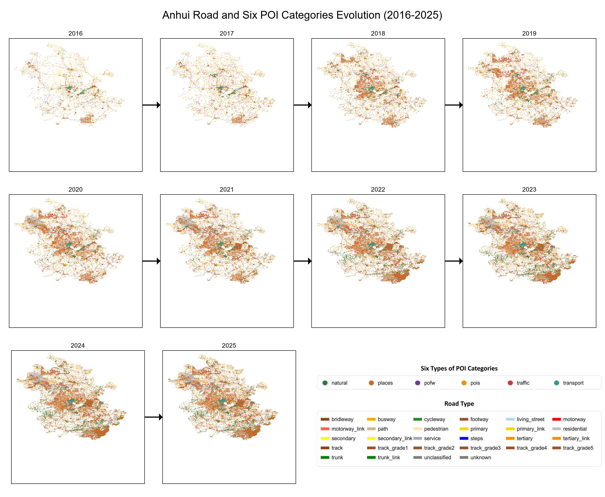

# China's 33 Provincial-Level Administrative Regions: 2016–2025 Road & Six Types of POI Evolution Atlas

This repository presents a comprehensive visualization of the spatiotemporal evolution of **road networks** (categorized by 28 fclass values) and **six categories of POI (Points of Interest)** across **33 provincial-level administrative regions in mainland China (excluding Taiwan Province)** from 2016 to 2025. For each province, we provide one high-resolution PNG image (1200 DPI) that includes:

- Year-by-year integrated road + POI maps (arranged in a grid, arrows indicate chronological flow)
- Year labels placed directly above each sub‑map
- A unified legend (road classes and POI categories)

All images are in landscape A4 layout, PNG format, suitable for academic papers, reports, or visual presentations.

## 📁 Repository Content

All evolution maps are stored in the `images` folder (on the `main` branch). There are 33 PNG files named as `ProvinceName_2016-2025_Evolution.png`. The root directory contains only this `README.md`.

> Note: Taiwan Province is not included.

## 🗺️ Legend

All images share a common legend (placed at the bottom right / right side), covering two categories of features:

### 🚗 Road Types (28 classes)

| Road Type (fclass) | RGB Color | Swatch |
|--------------------|-----------|--------|
| bridleway | (139, 69, 19) | 🟤 Saddle Brown |
| busway | (255, 165, 0) | 🟠 Orange |
| cycleway | (34, 139, 34) | 🟢 Forest Green |
| footway | (160, 82, 45) | 🟤 Ochre |
| living_street | (173, 216, 230) | 🔵 Light Blue |
| motorway | (255, 0, 0) | 🔴 Red |
| motorway_link | (255, 99, 71) | 🔴 Tomato |
| path | (210, 180, 140) | 🟤 Tan |
| pedestrian | (255, 228, 181) | 🟡 Khaki |
| primary | (255, 215, 0) | 🟡 Gold |
| primary_link | (255, 215, 0) | 🟡 Gold |
| residential | (192, 192, 192) | ⚪ Silver |
| secondary | (255, 255, 0) | 🟡 Yellow |
| secondary_link | (255, 255, 0) | 🟡 Yellow |
| service | (169, 169, 169) | ⚪ Dark Gray |
| steps | (0, 0, 255) | 🔵 Blue |
| tertiary | (255, 140, 0) | 🟠 Dark Orange |
| tertiary_link | (255, 140, 0) | 🟠 Dark Orange |
| track | (139, 69, 19) | 🟤 Saddle Brown |
| track_grade1 | (160, 82, 45) | 🟤 Ochre |
| track_grade2 | (160, 82, 45) | 🟤 Ochre |
| track_grade3 | (160, 82, 45) | 🟤 Ochre |
| track_grade4 | (160, 82, 45) | 🟤 Ochre |
| track_grade5 | (160, 82, 45) | 🟤 Ochre |
| trunk | (0, 128, 0) | 🟢 Green |
| trunk_link | (0, 128, 0) | 🟢 Green |
| unclassified | (128, 128, 128) | ⚪ Gray |
| unknown | (128, 128, 128) | ⚪ Gray |

> **Line width** in actual maps: **0.1 mm** (enlarged in the legend for readability).

### 📍 POI Categories (6 classes)

| POI Type | RGB Color | Swatch |
|----------|-----------|--------|
| natural | (44, 123, 57) | 🟢 Dark Green |
| places | (203, 103, 39) | 🟠 Orange‑Brown |
| pofw | (117, 56, 151) | 🟣 Purple |
| pois | (255, 140, 0) | 🟠 Dark Orange |
| traffic | (209, 58, 52) | 🔴 Red |
| transport | (53, 151, 143) | 🔵 Dark Cyan |

> **Symbol style**: solid circle, actual size **0.8 mm** (enlarged in the legend).

## 📊 Data Sources

- **Road data**: Shapefiles for each province, 2016–2025 (internal, not publicly shared).
- **POI data**: Six categories of POI shapefiles for the same period (internal, not publicly shared).

## ⚙️ Generation Method

### Tools
- QGIS 3.40+ (Python API)
- Custom QGIS batch export scripts

### Workflow
1. **Single-year composite**: Extract annual road networks (categorized by `fclass`) and six POI layers (fixed colors), overlay, and export as A4 PDF/PNG.
2. **Evolution mosaic**: Arrange the 10 composite images for each province in a grid (max 4 per row), place year labels above each sub‑image, connect years with arrows, and append a unified legend.
3. **High-resolution export**: PNG at **1200 DPI** to guarantee sharpness when zoomed in.

## 📈 Example

The image below shows the evolution for **Anhui Province** (2016–2025) as an example:

*All images follow the same layout and legend style and are stored in the `images` folder.*

## 📋 List of Covered Provinces and Regions

Beijing, Tianjin, Shanghai, Chongqing, Hebei, Shanxi, Liaoning, Jilin, Heilongjiang, Jiangsu, Zhejiang, Anhui, Fujian, Jiangxi, Shandong, Henan, Hubei, Hunan, Guangdong, Hainan, Sichuan, Guizhou, Yunnan, Shaanxi, Gansu, Qinghai, Inner Mongolia, Guangxi, Ningxia, Xinjiang, Xizang (Tibet), Hong Kong SAR, Macau SAR.

(33 provincial-level administrative regions; Taiwan Province excluded)

## 🔍 Potential Applications

- Urban expansion and transport infrastructure evolution studies
- Spatiotemporal distribution of POIs and urban functional changes
- Cross‑regional comparative analysis
- Academic paper illustrations, presentation slides, teaching cases

## 📄 License

The visual outputs in this repository are licensed under [CC BY-NC 4.0](https://creativecommons.org/licenses/by-nc/4.0/). The copyright of the original data belongs to the respective data collectors.

## ✉️ Contact

For questions or collaboration, please open a GitHub Issue.

---

**Last updated:** May 2025  
**Software used:** QGIS 3.40.11, Python 3.12  
**Data period:** 2016 – 2025
